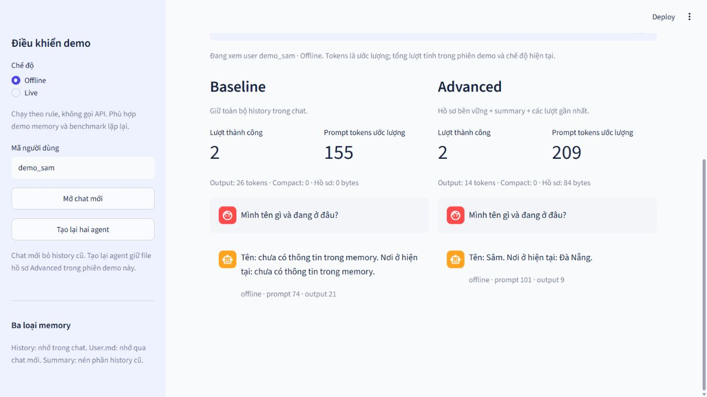

# Phần 5 — Giao diện web và chế độ live

Ngày 03/10/2026. Đã bổ sung UI tiếng Việt, service so sánh hai agent thật, script live smoke và test. Chưa commit/push; user tự push.

## Chạy giao diện

Từ root repo trong PowerShell:

```powershell
.\.venv\Scripts\python.exe -m pip install -r requirements-ui.txt
.\.venv\Scripts\python.exe -m streamlit run app.py --server.address 127.0.0.1
```

Mở http://127.0.0.1:8501. Môi trường .venv hiện đã cài Streamlit 1.65.0. Demo local không có đăng nhập/phân quyền cho public hosting.

## Đã làm được

- Hai cột Baseline/Advanced gọi đúng class của lab với cùng câu hỏi. Offline mặc định; Live chỉ gọi khi gửi/chọn tình huống mẫu, mỗi lượt so sánh gồm hai generation calls.
- Chat mới tạo thread mới; tạo lại agent đọc User.md trong đúng folder trước đó nhưng không còn history cũ. Mỗi browser session/chế độ có folder riêng `state/web/<mode>/<UUID>`; benchmark dùng state tạm độc lập.
- Đổi user tự mở thread mới. Người dùng khác không đọc nhầm hồ sơ trước. Refresh browser/restart server mở session riêng; nút tạo lại agent kiểm chứng file persistence trong folder demo hiện tại.
- Xem/tải User.md, summary, recent messages và các counters thật. Output/prompt tokens vẫn là estimator hiện có. Tổng lượt/tokens trên UI cộng các lượt hoàn thành trong phiên, kể cả qua chat mới và tạo lại agent; profile bytes là user hiện tại.
- Nút ngữ cảnh dài dành cho Offline để xem compact. Nút benchmark chạy hai suite gốc offline ngay cả khi đang chọn Live; tải được JSON mọi lượt/answers/hash/counters.
- Credentials dùng cấu hình .env/process, không nhập/in key trong UI hoặc evidence. Request live tắt external LangSmith tracing trong service và smoke. Lỗi SDK được rút gọn, không in raw exception; agent còn lại vẫn chạy, không fallback giả sang offline.
- Cập nhật .env được áp dụng cho adapters ở rerun tiếp theo, giữ folder profile. Khởi tạo cấu hình mới thất bại không thay thế agent cũ, nhưng UI dừng trước khi gửi với cấu hình không khớp. Input trắng được cảnh báo, không gọi model.
- Prompt live cho phép kiến thức kỹ thuật chung, giới hạn facts cá nhân vào memory/lời khai và ưu tiên profile mới hơn summary. Extraction/summary vẫn dùng rule, không phải LLM tool agent/LangGraph checkpointer.

Input có thể đã được ghi vào memory trước khi endpoint lỗi theo contract agent hiện tại. UI thông báo rõ; completed counters không tăng cho lượt lỗi. Số compact phản ánh các lần compact thực sự xảy ra, kể cả nếu generation sau đó thất bại.

## Kiểm chứng

12 test mới pass: service với agents/file thật, isolation, correction, restart, accounting, validation; AppTest chat/restart/rerun, benchmark không nhiễm profile, live routing, reload cấu hình và input trắng. Test live thay model bằng Runnable tại ranh giới ngoài, không dùng provider thật hay giả bảng số liệu.

Lần kiểm tra toàn repo sau bản sửa cuối: **165 passed trong 15,63 giây**. `pip check` không có requirements lỗi, `git diff --check` không có whitespace lỗi, dataset gốc không đổi; .env/state/.venv đều được ignore. Trên Windows sandbox, AppTest cần cho phép socketpair localhost; test vẫn chặn kết nối ra mạng ngoài.

Rà soát độc lập phát hiện config mới chưa được dùng và input trắng gây crash; đã viết regression fail trước sửa, rồi 12 tests pass. Reviewer xác nhận không còn Critical/Important findings trong scope và kiểm tra agent cũ còn nguyên khi khởi tạo config mới thất bại.

Browser QA đã chạy giới thiệu → chat mới → hỏi lại, thấy Baseline thiếu facts và Advanced nhớ Sâm/Đà Nẵng. Ảnh chụp giao diện thật:



## Kết quả gọi API thật

Đã chạy `scripts/check_live.py` thành công với provider adapter `openai`, model `gpt-6-luna` và gateway OpenAI-compatible DevQuota (`https://sv.devquote.shop/v1`). Run có đủ **6/6 generation responses** bằng dữ liệu giả lập: giới thiệu, tạo lại agents + recall ở thread mới và câu hỏi kỹ thuật cho hai agent.

Ba kiểm tra đều đạt: Baseline không có profile recall sau restart, Advanced nhớ lại Lan/Huế sau restart, và tất cả sáu lượt đều nhận response live. Nguồn bằng chứng: [PHAN_5_LIVE.json](PHAN_5_LIVE.json), `status: passed`. Script chỉ lưu câu trả lời/counters đã làm sạch, không lưu key hay state thật. Các checks chỉ kiểm tra route và memory substring, không phải LLM judge hoặc đánh giá độ đúng tổng quát của câu kỹ thuật.

API key được giữ trong `.env` local và không đưa vào Git. `load_config()` luôn ưu tiên environment hơn `.env`; nếu cửa sổ PowerShell còn overrides cũ, hãy bỏ chúng trước khi chạy lại:

```powershell
# Chỉ làm sau khi đã cấu hình provider/model/key/base URL hợp lệ trong .env.
Remove-Item Env:\OPENAI_API_KEY -ErrorAction SilentlyContinue
Remove-Item Env:\OPENAI_BASE_URL -ErrorAction SilentlyContinue
Remove-Item Env:\LLM_PROVIDER -ErrorAction SilentlyContinue
Remove-Item Env:\LLM_MODEL -ErrorAction SilentlyContinue

.\.venv\Scripts\python.exe scripts\check_live.py --output docs\PHAN_5_LIVE.json
.\.venv\Scripts\python.exe -m streamlit run app.py --server.address 127.0.0.1
```

Không ghi key vào chat/Git. Cấu hình hiện tại dùng gateway DevQuota và model `gpt-6-luna`; nếu đổi dịch vụ thì phải đổi đúng base URL do dịch vụ cấp. Nếu dùng SDK live trên máy mới, cài thêm `requirements-live.txt`. UI chọn Live ghi rõ provider/model; nếu API báo lỗi thì kiểm tra cấu hình, không coi đó là câu trả lời model.

Đã đối chiếu [OpenAI Docs về text generation](https://developers.openai.com/api/docs/guides/text) và [reported token usage](https://developers.openai.com/api/docs/guides/token-counting#understand-output-token-counts). Usage thực có thể gồm tokens không hiển thị; estimator theo ký tự trong lab không đại diện hóa đơn, kể cả khi mode là live. Adapter chat hiện giữ thiết kế multi-provider sẵn có; chưa tích hợp Responses API hoặc LLM judge.

## Demo và trạng thái nộp

1. Offline: Giới thiệu → Hỏi lại → Mở chat mới → Hỏi lại.
2. Đổi nơi ở → Tạo lại hai agent → Hỏi lại. Hồ sơ còn Huế, bỏ qua chuyến đi Hà Nội.
3. Đổi user sang demo_hai và hỏi tên; chuyển lại demo_sam để thấy đúng hồ sơ.
4. Ngữ cảnh dài → Hồ sơ & compact → Benchmark, xem trade-off và tải JSON.
5. Live: chạy smoke script hoặc chọn Live → giới thiệu lại → mở chat mới → hỏi lại → gửi câu kỹ thuật; đối chiếu `docs/PHAN_5_LIVE.json`.

Bản offline, UI và smoke live đều đã được kiểm chứng. Git commit/push/LMS vẫn do user thực hiện.
